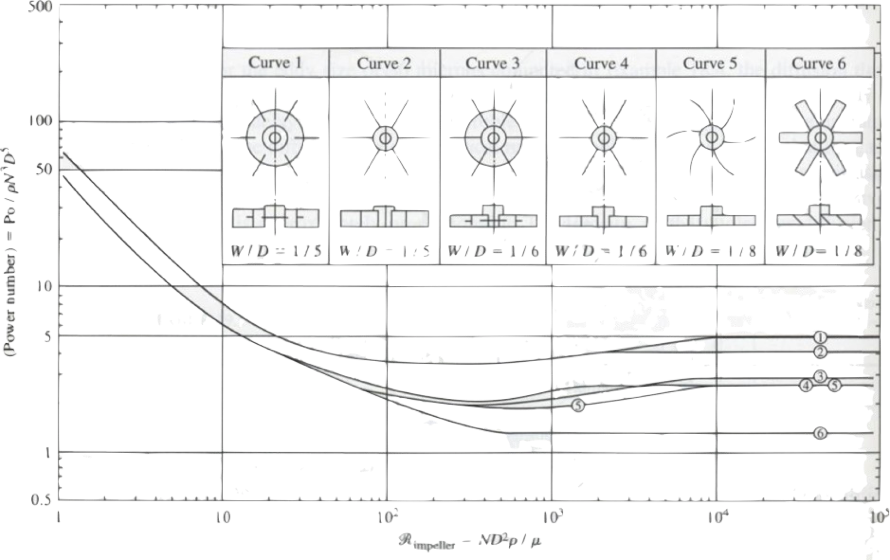

@def title = "4. Mezclado"

## 4 Mezclado

### 1

El análisis del contenido de grasa de un chopped cuyo contenido total de grasa es del 15 % ha dado los siguientes resultados expresados en %: 23.4, 10.4, 16.4, 19.6, 30.5, 7.6.

1. Calcular, para esta mezcla los índices de mezclado M₁, M₂ y M₃.

2. Si la mezcla se ha formado a partir de los ingredientes separados iniciales de grasa y carne magra después de 10 min de mezclado, calcular el índice de mezclado M₁ a los 5 min de haberse realizado el proceso. [[Earle](https://www.nzifst.org.nz/resources/unitoperations/mixing6.htm#problems)]
    
**[Solución](/assets/notebooks-html/prob4-1.jl.html)**
    
### 2

Un mezclador de líquidos con un agitador de hélice de 0.3 m de diámetro gira a 300 rpm en un tanque de 0.6 m de diámetro. 

1. Calcular la potencia a la que trabaja el equipo para agitar agua.

2. Calcular la potencia a la que trabaja el equipo para agitar aceite de oliva.

Datos: Viscosidad del agua = 1 mPa.s, densidad del agua = 1000 kg/m³. Viscosidad del aceite = 80 mPa.s, densidad del aceite = 914 kg/m³. [[Earle](https://www.nzifst.org.nz/resources/unitoperations/mixing6.htm#problems)]

**[Solución](/assets/notebooks-html/prob4-2.jl.html)**
    
### 3

Un agitador de hélice (agitador 1 de la figura) con un diámetro de 40 cm se utiliza para mezclar agua (μ = 1 cP). ¿A qué potencia debe trabajar el agitador para girar a 200 rpm?

**[Solución](/assets/notebooks-html/prob4-3.jl.html)**
    
### 4

Se mezclan 700 g de azúcar con 100 kg de harina. Durante el mezclado se toman 10 muestras de 10 g, a 1, 5 y 10 min y se analiza el porcentaje de azúcar. Los resultados son los siguientes:

Tiempo | 1 | 2 | 3 | 4 | 5 | 6 | 7 | 8 | 9 | 10
-------|---|---|---|---|---|---|---|---|---|----
1 min  |0.21|0.32|0.46|0.17|0.89|1.00|0.98|0.23|0.10|0.14
1.5 min |0.85|0.80|0.62|0.78|0.75|0.39|0.84|0.96|0.58|0.47
10 min |0.72|0.69|0.71|0.70|0.68|0.71|0.70|0.72|0.70|0.7

Calcular:
1. La desviación estándar de la mezcla para cada uno de los tiempos.
2. Seleccionar y calcular uno de los índices de mezclado.
3. Calcular la desviación estándar de la mezcla tras 6 min de operación. En este caso, se considerará una "mezcla perfecta", la que tenga $s_\infty$ = 0.001. [Fellows]

**[Solución](/assets/notebooks-html/prob4-4.jl.html)**

### 5

Se quiere mezclar un concentrado vitamínico con melazas espesas, habiéndose encontrado que se obtienen velocidades de mezclado aceptables con un depósito pequeño de 0.67 m de diámetro y altura 0.75 m con un mezclador de 0.33 m de diámetro girando a 450 rpm. Se ha diseñado una instalación mayor, que precisa de un depósito de 2 m de diámetro.

¿Cuáles son os valores adecuados a elegir para la profundidad del depósito, diámetro de la hélice y velocidad de rotación si se quieren conservar las mismas condiciones que en el depósito pequeño?

¿Cuál será la potencia necesaria para el motor de la hélice?

Datos:
Melaza: µ = 6.6 N s m⁻², ρ = 1520 kg m⁻³. Mezclador: _k_ = 41, _n_ = -1

**[Solución](/assets/notebooks-html/prob4-5.jl.html)**